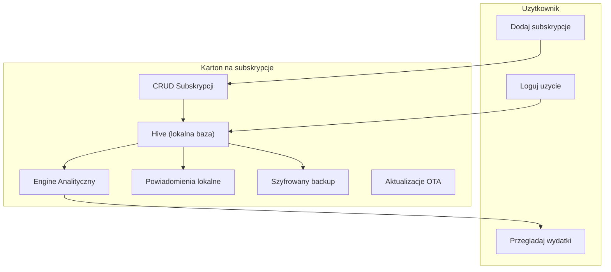

# Architektura

> **Powiazane:** [Roadmap](roadmap.md) | [Baza Danych](database.md) | [Bezpieczenstwo](security.md)
> | [Konwencje](standards/conventions.md)

---

## Przeglad Systemu



### Przeplyw danych

1. **CRUD subskrypcji:** Uzytkownik dodaje/edytuje subskrypcje -> zapis do Hive
2. **Usage tracking:** Uzytkownik loguje uzycie ("Uzylem dzisiaj") -> zapis do Hive
3. **Analityka:** Engine oblicza: total miesieczny, koszt/uzycie, ghost subscriptions, trendy
4. **Powiadomienia:** Lokalne notyfikacje o zblizajacych sie odnowieniach i ghost alerts
5. **Backup:** Eksport szyfrowany (AES-256-GCM) do pliku

---

## Stack Technologiczny

| Warstwa | Technologia |
|---------|-------------|
| **Framework** | Flutter (Dart) |
| **UI** | Material Design 3 ("Ledger Glass") |
| **Lokalna baza** | Hive (NoSQL, offline-first) |
| **State management** | ChangeNotifier + Provider |
| **Szyfrowanie** | AES-256-GCM (pointycastle) |
| **Aktualizacje** | OTA (ota_update + version.json) |
| **Wykresy** | fl_chart |
| **Powiadomienia** | flutter_local_notifications |
| **PDF** | pdf + printing |
| **Ikony** | Lucide Icons Flutter |

---

## Struktura katalogow

```text
lib/
├── config/
│   └── app_config.dart          # Build-time config (channels, URLs)
├── controllers/
│   └── selection_controller.dart # Multi-select (batch operations)
├── models/
│   ├── subscription.dart        # Glowna encja
│   ├── category.dart            # Kategorie subskrypcji
│   └── usage_event.dart         # Logowanie uzycia
├── services/
│   ├── app_logger.dart          # Circular log buffer
│   ├── backup_crypto_service.dart # E2E encryption (AES-256-GCM)
│   ├── storage_service.dart     # Hive + cache + CRUD
│   ├── analytics_service.dart   # Obliczenia: totale, trendy, ghost detection
│   ├── notification_service.dart # Lokalne powiadomienia
│   ├── update_service.dart      # OTA updates
│   ├── theme_provider.dart      # Dark/Light/System toggle
│   └── pdf_export_service.dart  # Eksport raportu PDF
├── theme/
│   └── app_theme.dart           # Ledger Glass tokens + ThemeData
├── screens/
│   ├── dashboard_screen.dart    # Glowny ekran: total, breakdown, alerty
│   ├── add_subscription_screen.dart # Formularz dodawania
│   ├── subscriptions_screen.dart # Lista subskrypcji
│   ├── analytics_screen.dart    # Wykresy i statystyki
│   └── settings_screen.dart     # Ustawienia, backup, OTA
├── widgets/
│   ├── subscription_card.dart   # Karta subskrypcji
│   ├── spending_chart.dart      # Wykres wydatkow
│   ├── category_breakdown.dart  # Podzial na kategorie
│   ├── budget_progress_bar.dart # Pasek budzetu
│   ├── ghost_alert.dart         # Alert nieuzywanych subskrypcji
│   └── filters_sheet.dart       # Filtry (kategoria, status, kwota)
└── main.dart                    # Entry point, provider setup
```

---

## Warstwy aplikacji

```
┌─────────────────────────────────────┐
│           UI (Screens + Widgets)     │  Flutter M3, Ledger Glass
├─────────────────────────────────────┤
│          Controllers                 │  SelectionController
├─────────────────────────────────────┤
│          Services                    │  Analytics, Notifications, Backup
├─────────────────────────────────────┤
│          Models                      │  Subscription, Category, UsageEvent
├─────────────────────────────────────┤
│          Storage (Hive)              │  Lokalna baza danych
└─────────────────────────────────────┘
```

### Analytics Engine (nowa warstwa)

Serce aplikacji -- obliczenia finansowe wykonywane lokalnie:

| Obliczenie | Wejscie | Wyjscie |
|------------|---------|---------|
| Monthly total | Wszystkie aktywne subskrypcje | Suma PLN/mies (normalizacja cykli) |
| Category breakdown | Subskrypcje + kategorie | Map<Category, double> |
| Cost per use | Subskrypcje + usage log | Ranking: najdrozszy koszt/uzycie |
| Ghost detection | Subskrypcje + usage log | Lista: >30 dni bez uzycia + aktywna |
| Yearly projection | Monthly total * 12 | Roczna prognoza |
| Spending trend | Historia 3/6/12 mies. | Lista<MonthlyTotal> do wykresu |

---

## Bezpieczenstwo

> Szczegoly: **[security.md](security.md)**

| Aspekt | Rozwiazanie |
|--------|-------------|
| **Dane lokalne** | Hive (offline-first, zero cloud) |
| **Bez kont** | Brak rejestracji, brak logowania |
| **Backup** | AES-256-GCM (device key lub haslo) |
| **Prywatnosc** | Dane finansowe nigdy nie opuszczaja urzadzenia |

---

> **Ostatnia aktualizacja:** 2026-03-25
