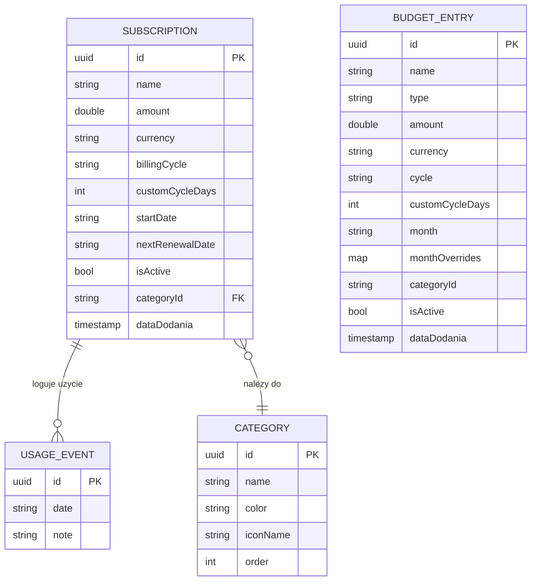

# Baza Danych

> **Powiazane:** [Architektura](architecture.md) | [Bezpieczenstwo](security.md) | [Roadmap](roadmap.md)

---

## Diagram ERD



> **BudgetEntry jest niezalezna od Subscription** — budzet to osobna, rownolegla
> warstwa, ktora dodatkowo czyta subskrypcje jako strumien kosztow
> (patrz [ADR-004](adr/ADR-004-model-budzetu-domowego.md)).

---

## Glowna Encja: Subscription

| Pole | Typ | Wymagane | Opis |
|------|-----|----------|------|
| `id` | UUID | tak | Unikalny identyfikator |
| `name` | string | tak | Nazwa subskrypcji ("Netflix", "Spotify") |
| `description` | string | nie | Opcjonalny opis |
| `amount` | double | tak | Kwota za okres rozliczeniowy |
| `currency` | Currency | tak | PLN, EUR, USD, GBP |
| `billingCycle` | BillingCycle | tak | weekly, monthly, quarterly, yearly, custom |
| `customCycleDays` | int | nie | Liczba dni (tylko gdy cycle == custom) |
| `categoryId` | UUID | nie | ID kategorii |
| `startDate` | ISO8601 | tak | Data rozpoczecia subskrypcji |
| `nextRenewalDate` | ISO8601 | nie | Computed lub manual: nastepne odnowienie |
| `cancellationUrl` | string | nie | URL do anulowania |
| `iconName` | string | nie | Nazwa ikony Lucide |
| `color` | string | nie | Kolor hex karty (#2563EB) |
| `isPinned` | bool | nie | Przypieta na gorze listy |
| `isActive` | bool | tak | Aktywna vs anulowana |
| `reminderDaysBefore` | int | nie | Przypomnij X dni przed odnowieniem |
| `usageLog` | UsageEvent[] | tak | Historia uzycia (uspione — UI usuniete) |
| `scope` | SubscriptionScope | tak | Przynaleznosc: personal / household (default personal) |
| `dataDodania` | ISO8601 | tak | Timestamp dodania |

---

## Encja: UsageEvent

| Pole | Typ | Wymagane | Opis |
|------|-----|----------|------|
| `id` | UUID | tak | Unikalny identyfikator |
| `date` | ISO8601 | tak | Data uzycia |
| `note` | string | nie | Opcjonalna notatka ("Obejrzalem film") |

---

## Encja: Category

| Pole | Typ | Wymagane | Opis |
|------|-----|----------|------|
| `id` | UUID | tak | Unikalny identyfikator |
| `name` | string | tak | Nazwa kategorii (max 20 znakow) |
| `color` | string | tak | Kolor hex |
| `iconName` | string | tak | Nazwa ikony Lucide |
| `order` | int | tak | Kolejnosc wyswietlania |

**Limity:** max 20 kategorii

---

## Encja: BudgetEntry (budzet domowy)

Jeden model dla wszystkich pozycji budzetu. Typ okresla zachowanie
(normalizacja cykliczna vs przypisanie do konkretnej daty).

| Pole | Typ | Wymagane | Opis |
|------|-----|----------|------|
| `id` | UUID | tak | Unikalny identyfikator |
| `name` | string | tak | Nazwa pozycji |
| `type` | BudgetEntryType | tak | income / bill / recurringCost / oneTimeExpense / oneTimeIncome / householdTransfer |
| `amount` | double | tak | Kwota (>0) w walucie `currency` |
| `currency` | Currency | tak | PLN, EUR, USD, GBP |
| `cycle` | BillingCycle | tak* | Cykl dla typow cyklicznych (default monthly) |
| `customCycleDays` | int | nie | Liczba dni (gdy cycle == custom) |
| `month` | string "YYYY-MM" | tak* | Miesiac przypisania (typy jednorazowe) |
| `monthOverrides` | Map<"YYYY-MM", BillMonthOverride> | nie | **Korekty miesieczne — tylko `bill`** (rachunek zmienny): inna data/kwota w danym miesiacu. Patrz [ADR-008](adr/ADR-008-rachunek-zmienny-surplus-vs-bilans.md) |
| `categoryId` | UUID | nie | Kategoria pozycji (subskrypcje + wydatki budzetu) |
| `startDate` | ISO8601 | nie | **Kotwica daty kalendarza:** dokladna data jednorazowego; data pierwszego wystapienia cyklicznego |
| `isActive` | bool | tak | Wstrzymane pozycje nie licza sie do sum |
| `note` | string | nie | Opcjonalna notatka |
| `linkId` | string | nie | Spina pare przelew↔wklad (osobisty↔domowy) |
| `dataDodania` | ISO8601 | tak | Timestamp dodania |

`* zaleznie od typu` — `cycle` dla cyklicznych, `month` dla jednorazowych.

```dart
enum BudgetEntryType {
  income, bill, recurringCost, oneTimeExpense, oneTimeIncome, householdTransfer
}
enum BudgetScope { personal, household } // wybiera box (osobny zbior dla domowego)

class BillMonthOverride {       // korekta rachunku dla jednego miesiaca
  final double? amount;         // null = kwota bazowa
  final DateTime? date;         // null = data projekcji wg cyklu
}
```

**`bill` vs `recurringCost` (ADR-008):** oba to koszty cykliczne, ale rozne:
- **`bill` (rachunek) = zmienny** — kwota bazowa + cykl jako domyslne; w kazdym
  miesiacu mozna nadpisac date i kwote (`monthOverrides`). Przyklad: fryzjer co
  miesiac, inny dzien, czasem inna cena.
- **`recurringCost` (koszt cykliczny) = staly** — stala kwota w interwale, bez korekt.

**Korekty NIE zmieniaja „zostaje/mies" (surplus = plan, liczony z kwoty bazowej)** —
wplywaja tylko na **bilans danego miesiaca** i **kalendarz**. Patrz
[ADR-008](adr/ADR-008-rachunek-zmienny-surplus-vs-bilans.md).

**Zakres (osobisty vs domowy):** to nie pole pozycji, lecz **osobny box**:
`budget_entries` (osobisty, lokalny) i `household_budget_entries` (domowy, przyszla
synchronizacja). `householdTransfer` to koszt w osobistym tworzacy lustrzany `income`
w domowym (spiety `linkId`). Patrz [ADR-006](adr/ADR-006-budzet-domowy-osobny-zbior.md).

**Computed:**
- `isIncome` — `income` lub `oneTimeIncome`; `isOneTime` — `oneTimeExpense` lub `oneTimeIncome`
- `monthlyAmount` — kwota/mies (typy cykliczne); `0` dla jednorazowych
- `signedMonthlyAmount` — wplyw `+`, koszt `-`, jednorazowy `0`

**Agregaty (`BudgetService`):**

| Obliczenie | Wzor |
|------------|------|
| Wplywy/mies | suma `monthlyAmount` aktywnych wplywow cyklicznych |
| Koszty/mies | koszty cykliczne budzetu **+** suma miesieczna subskrypcji |
| Zostaje/mies (surplus) | wplywy - koszty/mies (rachunki liczone z **kwoty bazowej**) |
| Bilans miesiaca | surplus **+** jednorazowe wplywy - jednorazowe wydatki - **korekty rachunkow** danego miesiaca |
| Kalendarz dnia | rzutowanie wystapien (`occurrencesInRange`); rachunek z korekta bierze jej date/kwote |

Normalizacja cyklu i rzutowanie wystapien: `lib/utils/cycle_math.dart`
(`monthlyFromCycle`, `occurrencesInRange`).

---

### Predefiniowane kategorie

| Nazwa | Ikona | Kolor |
|-------|-------|-------|
| Streaming | `play-circle` | `#2563EB` (Blue) |
| Muzyka | `headphones` | `#7C3AED` (Violet) |
| Cloud | `cloud` | `#0891B2` (Cyan) |
| Software | `code` | `#EA580C` (Orange) |
| Fitness | `dumbbell` | `#16A34A` (Green) |
| Gaming | `gamepad-2` | `#DB2777` (Pink) |
| Edukacja | `graduation-cap` | `#D97706` (Amber) |
| Inne | `folder` | `#64748B` (Slate) |

---

## Enums

```dart
enum BillingCycle { weekly, monthly, quarterly, yearly, custom }

enum Currency {
  PLN, EUR, USD, GBP;

  String get symbol {
    switch (this) {
      case Currency.PLN: return 'zl';
      case Currency.EUR: return 'EUR';
      case Currency.USD: return '\$';
      case Currency.GBP: return 'GBP';
    }
  }
}
```

---

## Dart Interfaces

```dart
class Subscription {
  final String id;
  final String name;
  final String? description;
  final double amount;
  final Currency currency;
  final BillingCycle billingCycle;
  final int? customCycleDays;
  final String? categoryId;
  final String startDate;          // ISO8601
  final String? nextRenewalDate;   // ISO8601, computed
  final String? cancellationUrl;
  final String? iconName;
  final String? color;
  final bool isPinned;
  final bool isActive;
  final int? reminderDaysBefore;
  final List<UsageEvent> usageLog;
  final String dataDodania;        // ISO8601

  // Computed: miesięczny koszt znormalizowany
  double get monthlyAmount {
    switch (billingCycle) {
      case BillingCycle.weekly: return amount * 4.33;
      case BillingCycle.monthly: return amount;
      case BillingCycle.quarterly: return amount / 3;
      case BillingCycle.yearly: return amount / 12;
      case BillingCycle.custom:
        if (customCycleDays == null || customCycleDays! <= 0) return 0;
        return amount / customCycleDays! * 30.44;
    }
  }

  // Computed: roczny koszt
  double get yearlyAmount => monthlyAmount * 12;

  // Computed: dni od ostatniego uzycia
  int? get daysSinceLastUse {
    if (usageLog.isEmpty) return null;
    final lastUse = DateTime.tryParse(usageLog.last.date);
    if (lastUse == null) return null;
    return DateTime.now().difference(lastUse).inDays;
  }

  // Computed: czy to ghost subscription (>30 dni bez uzycia)
  bool get isGhost {
    if (!isActive) return false;
    final days = daysSinceLastUse;
    return days != null && days > 30;
  }

  // Computed: koszt na uzycie (kwota miesieczna / uzycia w ostatnich 30 dniach)
  double? get costPerUse {
    if (usageLog.isEmpty) return null;
    final thirtyDaysAgo = DateTime.now().subtract(Duration(days: 30));
    final recentUses = usageLog.where((e) {
      final date = DateTime.tryParse(e.date);
      return date != null && date.isAfter(thirtyDaysAgo);
    }).length;
    if (recentUses == 0) return null;
    return monthlyAmount / recentUses;
  }
}

class UsageEvent {
  final String id;
  final String date;    // ISO8601
  final String? note;
}

class Category {
  final String id;
  final String name;
  final String color;   // HEX
  final String iconName; // Lucide icon name
  final int order;
}
```

---

## Przechowywanie danych

| Metoda | Opis |
|--------|------|
| Hive Box: `subscriptions` | JSON subskrypcji (String values) |
| Hive Box: `categories` | JSON kategorii |
| Hive Box: `payment_methods` | JSON metod platnosci |
| Hive Box: `budget_entries` | JSON pozycji budzetu **osobistego** (lokalny) |
| Hive Box: `household_budget_entries` | JSON pozycji budzetu **domowego** (przyszla synchronizacja) |
| Hive Box: `settings` | Key-value: waluta domyslna, budzet, preferencje |

Wzorzec: ten sam co w APPteczka (StorageService z cache + lazy deserialization).
Referencja: `reference-code/services/storage_service.dart`

---

## Schematy walidacji

Do zdefiniowania w fazie implementacji:
- JSON Schema dla importu/eksportu subskrypcji
- Walidacja kwot (>0, max 2 miejsca po przecinku)
- Walidacja dat (ISO8601, nie w przeszlosci dla startDate)

---

## Import/Eksport Excel (.xlsx)

> **ADR:** [ADR-003 Format importu/eksportu Excel](adr/ADR-003-format-import-eksport-excel.md)

Format "otwarty", czytelny i edytowalny recznie — w odroznieniu od zaszyfrowanego
backupu `.subkarton`. Serwis: `lib/services/excel_service.dart`.

### Kolumny arkusza

| Kolumna | Wymagana przy imporcie | Domyslna wartosc | Uwagi |
|---------|------------------------|------------------|-------|
| Nazwa | tak | — | Pusta = wiersz pominiety. Max 100 znakow. |
| Kwota | tak | — | >0 i <= 1 000 000. Akceptuje `43,00` i `43.00`, separator tysiecy. |
| Waluta | nie | PLN | PLN/EUR/USD/GBP (po nazwie lub etykiecie). |
| Cykl | nie | miesiecznie | tygodniowo/miesiecznie/kwartalnie/rocznie/`co N dni`. |
| Kategoria | nie | brak | Tylko dopasowanie po nazwie do istniejacych (nie tworzy nowych). |
| Metoda platnosci | nie | brak | Tylko dopasowanie po nazwie do istniejacych. |
| Aktywna | nie | tak | `nie/no/false/0/anulowana` = nieaktywna. |
| Data startu | nie | dzis | ISO8601 lub `dd.MM.yyyy`. Poza zakresem 1990..+50 lat → dzis. |

Naglowek jest wykrywany automatycznie. Brak rozpoznawalnego naglowka → uklad
pozycyjny: kolumna 0 = Nazwa, kolumna 1 = Kwota.

**Arkusz budzetu** (osobny): kolumny Typ / Nazwa / Kwota / Waluta / Cykl / **Kategoria** /
Miesiac / Notatka / Aktywna. Kategoria dopasowywana po nazwie (tylko dla wydatkow).
Korekty miesieczne rachunku (`monthOverrides`) NIE sa eksportowane — Excel niesie
tylko kwote bazowa (decyzja: pierwsza iteracja).

### Reguly bezpieczenstwa importu

- Parsowanie poza glownym watkiem (`compute`) — duzy/spreparowany plik nie zawiesi UI.
- Limity: rozmiar pliku 5 MB, liczba wierszy danych 2000.
- Kazda subskrypcja dostaje NOWE id — import nigdy nie nadpisuje istniejacych.
- Bledne wiersze sa pomijane i raportowane (nie przerywaja importu).

### Reguly bezpieczenstwa eksportu

- Komorki tekstowe zaczynajace sie od `= + - @ TAB CR` sa poprzedzane apostrofem
  (ochrona przed wstrzknieciem formul / CSV injection u odbiorcy).
- Eksport jest JAWNY (nieszyfrowany) — UI sygnalizuje to podpisem "plik nieszyfrowany".

---

> **Ostatnia aktualizacja:** 2026-06-17
