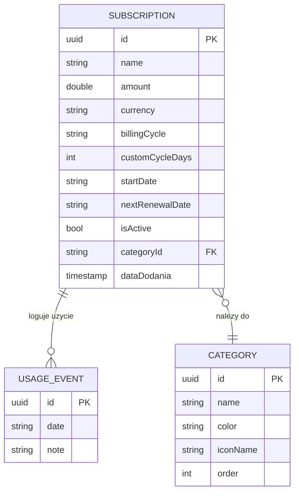

# Baza Danych

> **Powiazane:** [Architektura](architecture.md) | [Bezpieczenstwo](security.md) | [Roadmap](roadmap.md)

---

## Diagram ERD



---

## Glowna Encja: Subscription

| Pole | Typ | Wymagane | Opis |
|------|-----|----------|------|
| `id` | UUID | tak | Unikalny identyfikator |
| `name` | string | tak | Nazwa subskrypcji ("Netflix", "Spotify") |
| `description` | string | nie | Opcjonalny opis |
| `amount` | double | tak | Kwota za okres rozliczeniowy |
| `currency` | Currency | tak | PLN, EUR, USD, GBP |
| `billingCycle` | BillingCycle | tak | weekly, monthly, quarterly, yearly, custom |
| `customCycleDays` | int | nie | Liczba dni (tylko gdy cycle == custom) |
| `categoryId` | UUID | nie | ID kategorii |
| `startDate` | ISO8601 | tak | Data rozpoczecia subskrypcji |
| `nextRenewalDate` | ISO8601 | nie | Computed lub manual: nastepne odnowienie |
| `cancellationUrl` | string | nie | URL do anulowania |
| `iconName` | string | nie | Nazwa ikony Lucide |
| `color` | string | nie | Kolor hex karty (#2563EB) |
| `isPinned` | bool | nie | Przypieta na gorze listy |
| `isActive` | bool | tak | Aktywna vs anulowana |
| `reminderDaysBefore` | int | nie | Przypomnij X dni przed odnowieniem |
| `usageLog` | UsageEvent[] | tak | Historia uzycia |
| `dataDodania` | ISO8601 | tak | Timestamp dodania |

---

## Encja: UsageEvent

| Pole | Typ | Wymagane | Opis |
|------|-----|----------|------|
| `id` | UUID | tak | Unikalny identyfikator |
| `date` | ISO8601 | tak | Data uzycia |
| `note` | string | nie | Opcjonalna notatka ("Obejrzalem film") |

---

## Encja: Category

| Pole | Typ | Wymagane | Opis |
|------|-----|----------|------|
| `id` | UUID | tak | Unikalny identyfikator |
| `name` | string | tak | Nazwa kategorii (max 20 znakow) |
| `color` | string | tak | Kolor hex |
| `iconName` | string | tak | Nazwa ikony Lucide |
| `order` | int | tak | Kolejnosc wyswietlania |

**Limity:** max 20 kategorii

### Predefiniowane kategorie

| Nazwa | Ikona | Kolor |
|-------|-------|-------|
| Streaming | `play-circle` | `#2563EB` (Blue) |
| Muzyka | `headphones` | `#7C3AED` (Violet) |
| Cloud | `cloud` | `#0891B2` (Cyan) |
| Software | `code` | `#EA580C` (Orange) |
| Fitness | `dumbbell` | `#16A34A` (Green) |
| Gaming | `gamepad-2` | `#DB2777` (Pink) |
| Edukacja | `graduation-cap` | `#D97706` (Amber) |
| Inne | `folder` | `#64748B` (Slate) |

---

## Enums

```dart
enum BillingCycle { weekly, monthly, quarterly, yearly, custom }

enum Currency {
  PLN, EUR, USD, GBP;

  String get symbol {
    switch (this) {
      case Currency.PLN: return 'zl';
      case Currency.EUR: return 'EUR';
      case Currency.USD: return '\$';
      case Currency.GBP: return 'GBP';
    }
  }
}
```

---

## Dart Interfaces

```dart
class Subscription {
  final String id;
  final String name;
  final String? description;
  final double amount;
  final Currency currency;
  final BillingCycle billingCycle;
  final int? customCycleDays;
  final String? categoryId;
  final String startDate;          // ISO8601
  final String? nextRenewalDate;   // ISO8601, computed
  final String? cancellationUrl;
  final String? iconName;
  final String? color;
  final bool isPinned;
  final bool isActive;
  final int? reminderDaysBefore;
  final List<UsageEvent> usageLog;
  final String dataDodania;        // ISO8601

  // Computed: miesięczny koszt znormalizowany
  double get monthlyAmount {
    switch (billingCycle) {
      case BillingCycle.weekly: return amount * 4.33;
      case BillingCycle.monthly: return amount;
      case BillingCycle.quarterly: return amount / 3;
      case BillingCycle.yearly: return amount / 12;
      case BillingCycle.custom:
        if (customCycleDays == null || customCycleDays! <= 0) return 0;
        return amount / customCycleDays! * 30.44;
    }
  }

  // Computed: roczny koszt
  double get yearlyAmount => monthlyAmount * 12;

  // Computed: dni od ostatniego uzycia
  int? get daysSinceLastUse {
    if (usageLog.isEmpty) return null;
    final lastUse = DateTime.tryParse(usageLog.last.date);
    if (lastUse == null) return null;
    return DateTime.now().difference(lastUse).inDays;
  }

  // Computed: czy to ghost subscription (>30 dni bez uzycia)
  bool get isGhost {
    if (!isActive) return false;
    final days = daysSinceLastUse;
    return days != null && days > 30;
  }

  // Computed: koszt na uzycie (kwota miesieczna / uzycia w ostatnich 30 dniach)
  double? get costPerUse {
    if (usageLog.isEmpty) return null;
    final thirtyDaysAgo = DateTime.now().subtract(Duration(days: 30));
    final recentUses = usageLog.where((e) {
      final date = DateTime.tryParse(e.date);
      return date != null && date.isAfter(thirtyDaysAgo);
    }).length;
    if (recentUses == 0) return null;
    return monthlyAmount / recentUses;
  }
}

class UsageEvent {
  final String id;
  final String date;    // ISO8601
  final String? note;
}

class Category {
  final String id;
  final String name;
  final String color;   // HEX
  final String iconName; // Lucide icon name
  final int order;
}
```

---

## Przechowywanie danych

| Metoda | Opis |
|--------|------|
| Hive Box: `subscriptions` | JSON subskrypcji (String values) |
| Hive Box: `categories` | JSON kategorii |
| Hive Box: `settings` | Key-value: waluta domyslna, budzet, preferencje |

Wzorzec: ten sam co w APPteczka (StorageService z cache + lazy deserialization).
Referencja: `reference-code/services/storage_service.dart`

---

## Schematy walidacji

Do zdefiniowania w fazie implementacji:
- JSON Schema dla importu/eksportu subskrypcji
- Walidacja kwot (>0, max 2 miejsca po przecinku)
- Walidacja dat (ISO8601, nie w przeszlosci dla startDate)

---

> **Ostatnia aktualizacja:** 2026-03-25
